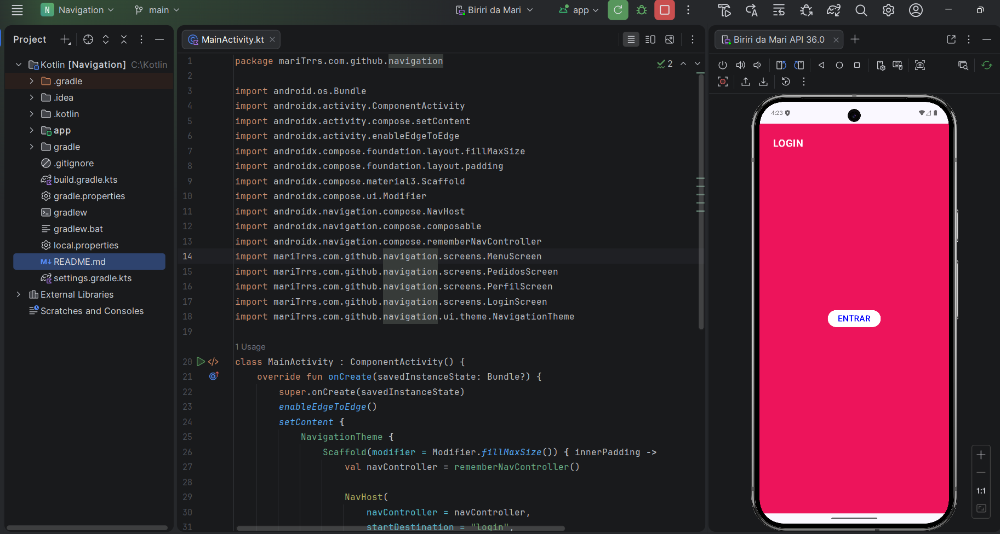
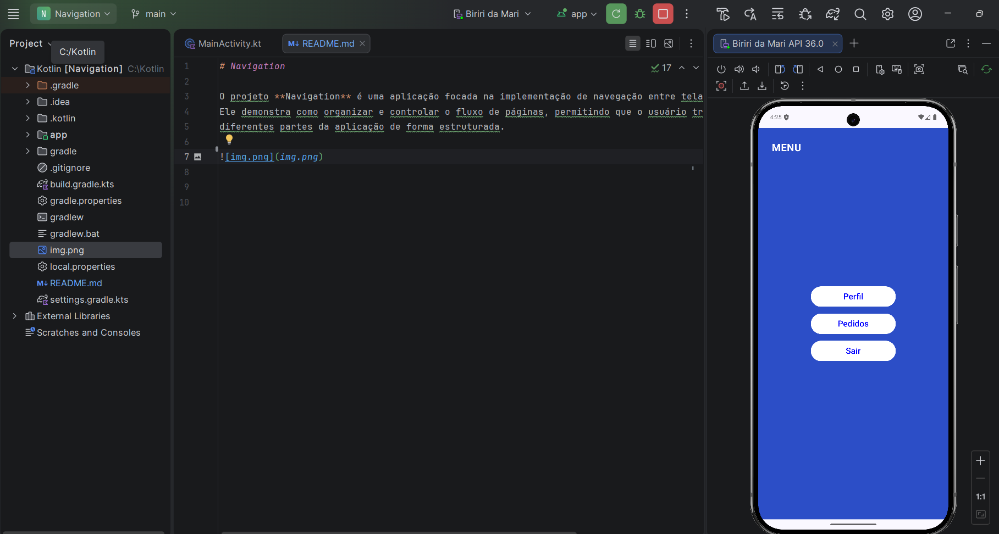
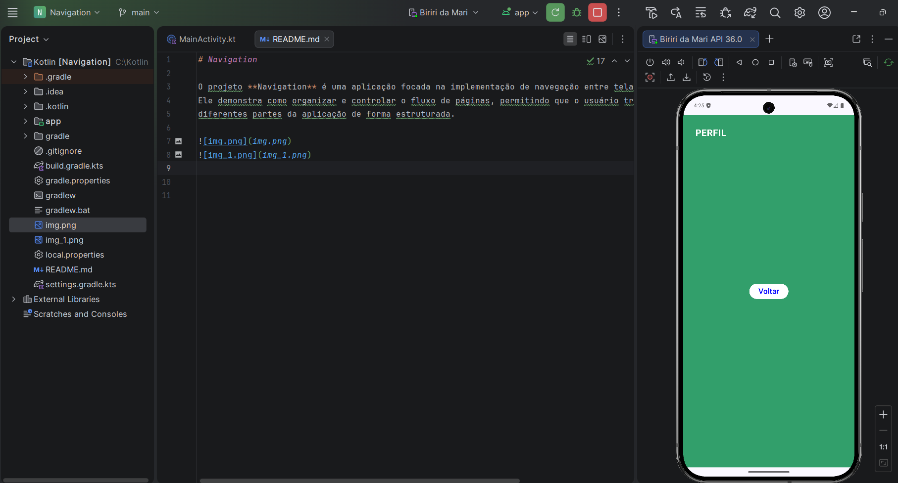
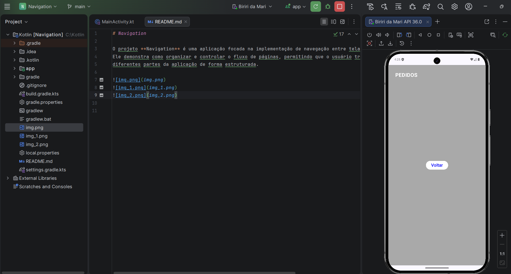

# Navigation

O projeto **Navigation** é uma aplicação focada na implementação de navegação entre telas dentro de um sistema.
Ele demonstra como organizar e controlar o fluxo de páginas, permitindo que o usuário transite entre
diferentes partes da aplicação de forma estruturada.

